# Hetu 河图

> 本地优先的 AI 知识与 Agent 工作台 — 笔记、对话与编码会话在同一处沉淀为可检索、可连接的知识。

[English](./README.md) | 简体中文

🌐 官网与文档（GitHub Pages）：<https://wosledon.github.io/Hetu/>

Hetu（河图）是一个**本地优先**的知识与 Agent 工作台：Markdown 笔记、对话、编码会话共用一套存储，向下由向量索引、知识图谱、长期记忆与任务/工作流把内容串成一张活的网络。所有数据与模型调用都在你自己的机器上，不需要账号，也不上传内容。

- **双引擎**：`笔记`（写）与 `Agent 工作台`（问、做）用同一套知识底座，笔记可以随时被检索、索引、抽取图谱。
- **能动手**：Code 会话直接在你的仓库里工作 —— 独立工作树、分支、Git 同步、文件/终端/浏览器面板、PR 创建，全部对话驱动。
- **可组合**：MCP 工具、技能、智能体、工作流、看板任务都围绕同一个 Agent 循环。
- **本地优先**：SQLite + `sqlite-vec` 开箱即用，也可切到 PostgreSQL + `pgvector`。

## 🖼️ 界面一览

| 笔记 | Agent 工作台（对话 + Code） |
| --- | --- |
| 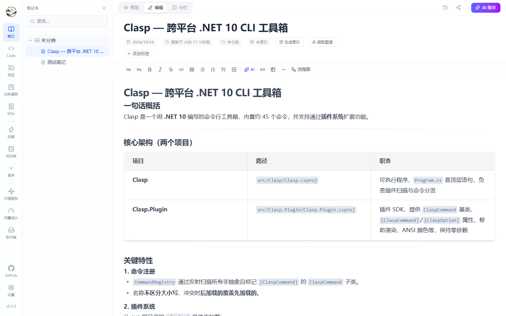 | 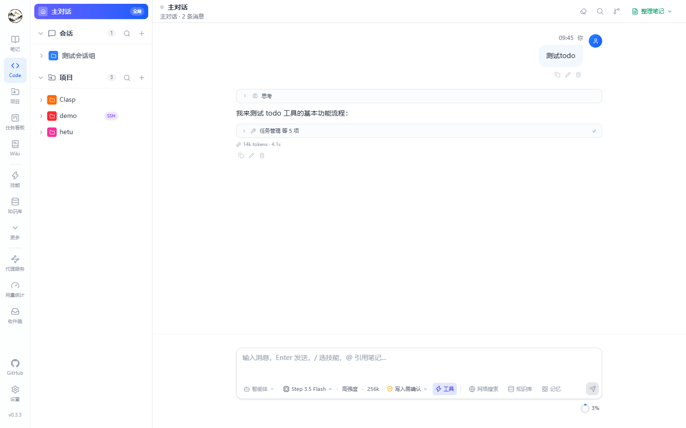 |

| 知识库 | 知识图谱 |
| --- | --- |
| 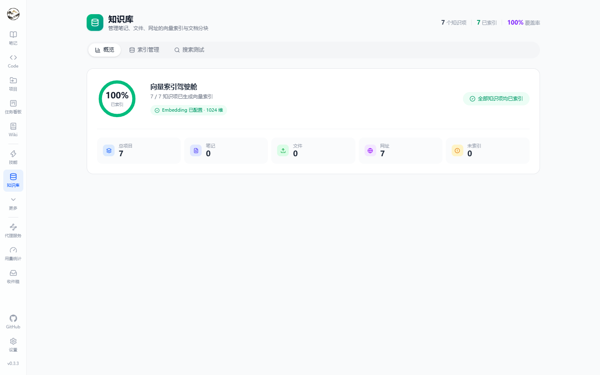 | 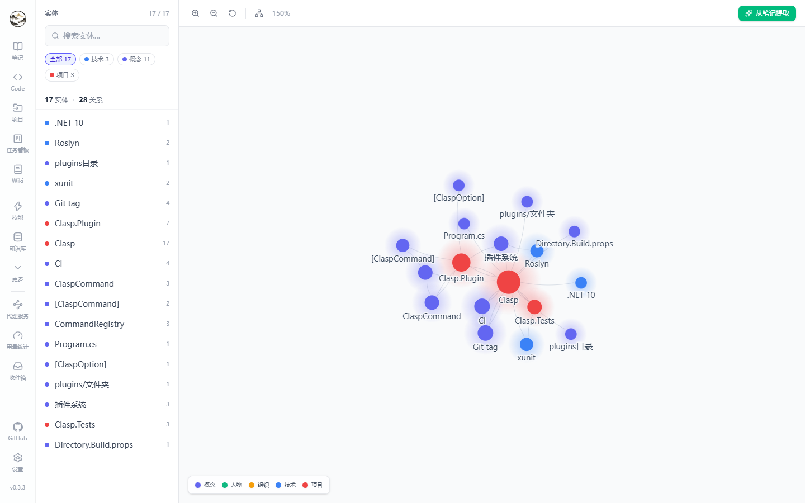 |

| 记忆（含 Dream 巩固） | Wiki 生成 |
| --- | --- |
| 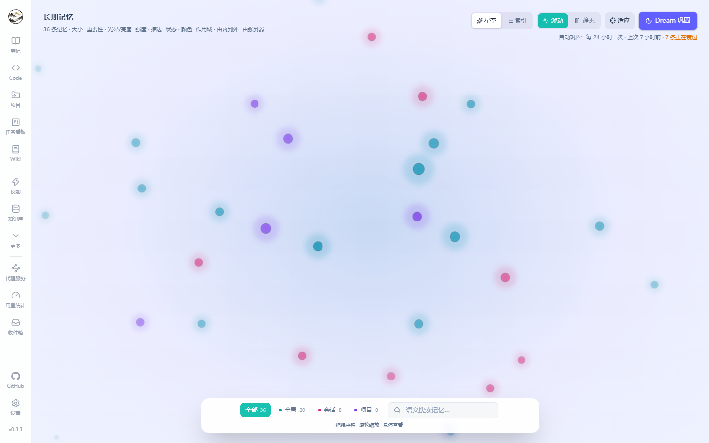 | 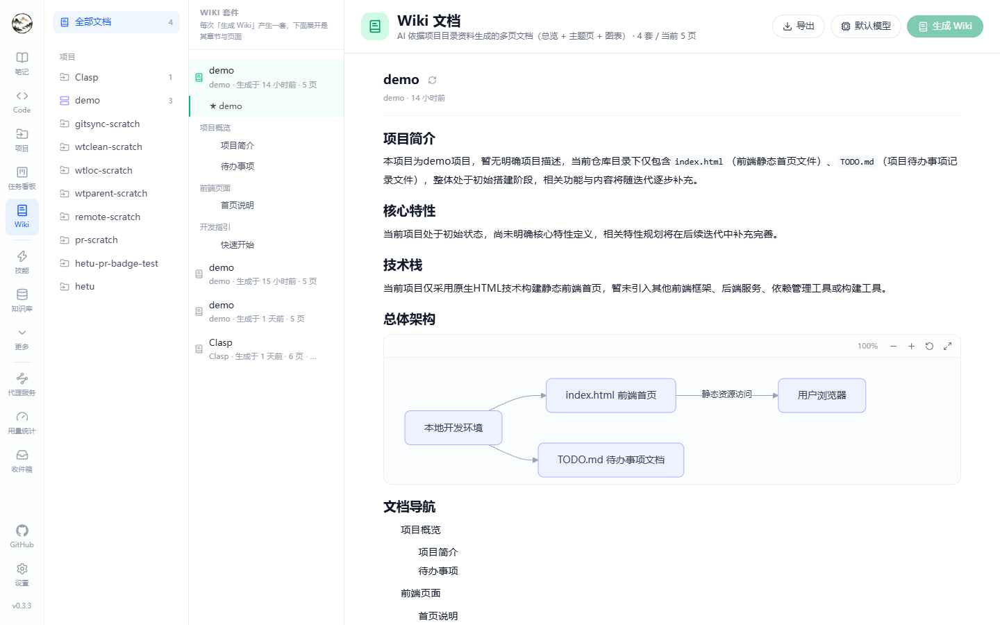 |

| 任务看板 | 用量统计 |
| --- | --- |
| 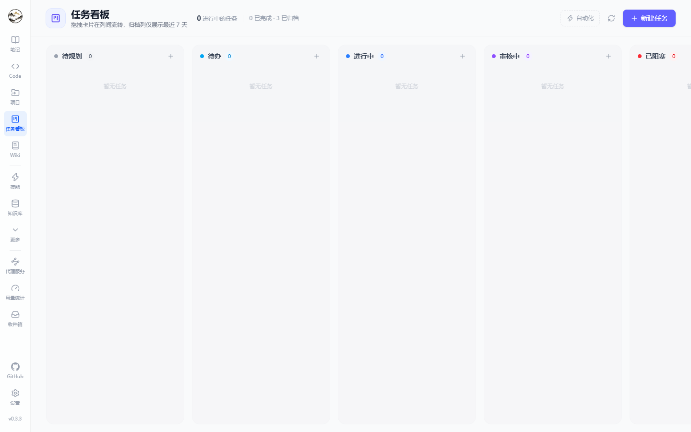 | 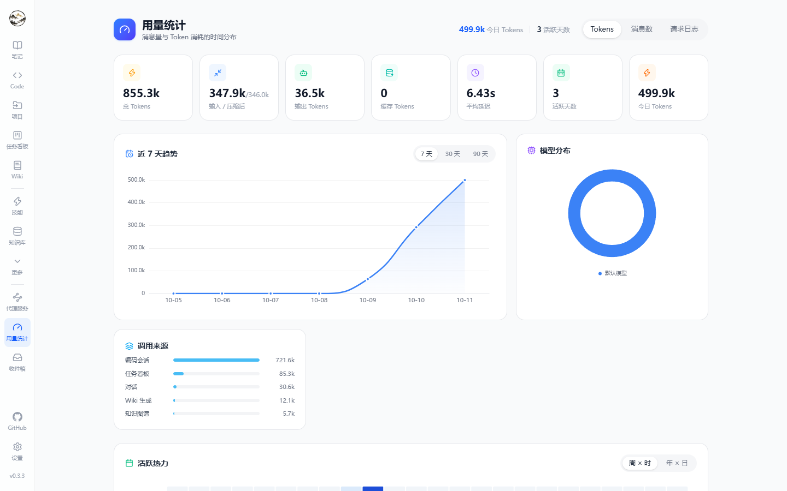 |

| 项目（本地 / SSH） | 后台任务 |
| --- | --- |
| 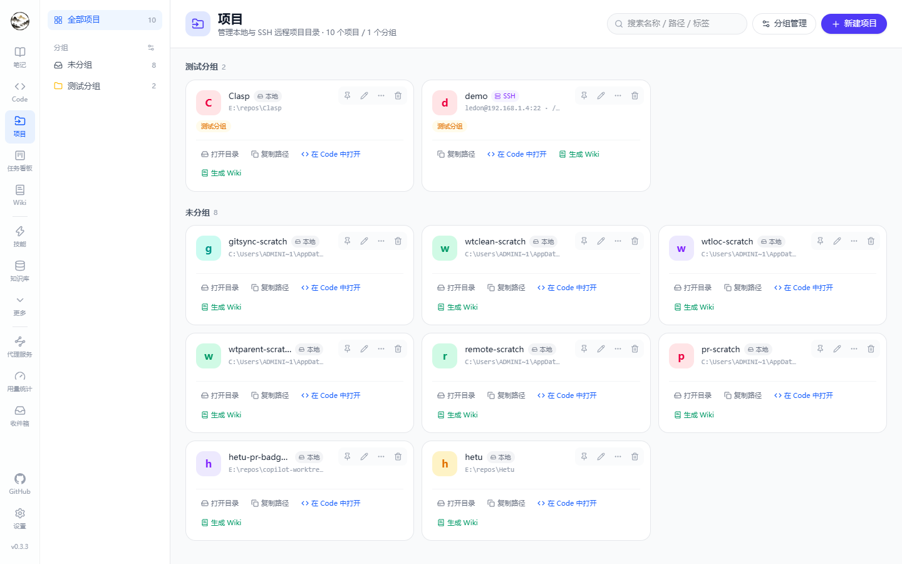 | 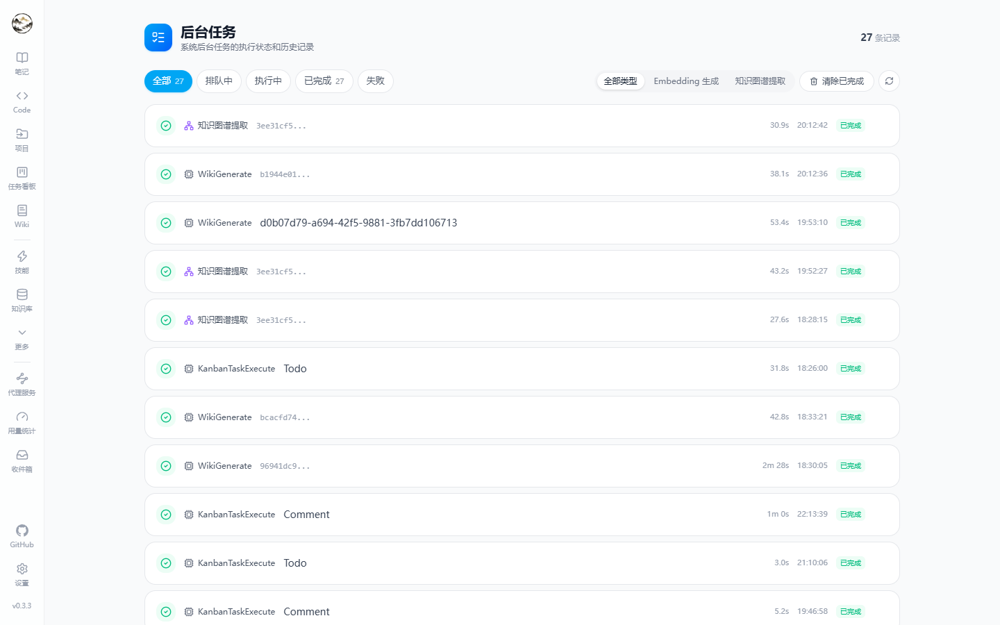 |

---

## ✨ 功能

### 📝 笔记

- **所见即所得 Markdown**（Milkdown）+ **CodeMirror 源码视图**，编辑 / 预览 / 分屏三种模式。
- **AI 写作**：选中文本可直接润色 / 翻译 / 精简 / 扩写 / 解释 / 自定义；整篇笔记有 AI 助手面板，可**按次指定模型**（不受默认模型限制）。
- **笔记内 AI 动作**：生成索引、提取知识图谱、添加标签、生成流程图。
- **无限层级笔记本**（含「未分类」）、**标签**（配色 / 重命名 / 合并 / 侧栏筛选）。
- **3 秒自动保存** + 保存状态指示；**历史版本**自动快照，可预览、对比、一键还原。
- **分享链接**（永久 / 24 小时 / 3 天）带访问计数，公开只读页 `/share/:code`。
- **回收站**（软删除）与 **Markdown 导出 / 数据库备份**。

### 🤖 Agent 工作台（`/code`）

对话与编码会话在同一个工作台里，左侧是会话/话题树，右侧是消息流。

- **会话与话题**：分组管理话题，每个话题独立模型、系统提示、上下文与历史；消息可复制 / 编辑 / 删除，话题可**分叉**探索。
- **SSE 流式**：`delta`、思考过程、联网搜索结果、知识库命中、记忆命中、工具调用/结果、交互式提问、实时待办清单、检查点、审批请求。
- **深度思考**开关与推理强度（低 / 中 / 高），思考轨迹可折叠。
- **输入框工具带**：联网搜索 · 知识库 · 记忆 · 权限模式 · 模型 · 智能体 · 技能（`/` 唤起）。
- **权限模式五档**：`计划` / `只读` / `询问` / `自动` / `绕过`；Code 会话另有**运行模式**：交互式逐步确认 / Autopilot 托管执行。
- **发送队列与运行中引导**：回复进行中继续输入会排队（可编辑/删除/直接发送），也可点「引导」把新指令立刻插进当前这一轮。
- **附件与长文本**：图片、文件、粘贴的超长文本折叠块。
- **整理成笔记**：把话题蒸馏成 Markdown 笔记（摘要 / 详细 / 问答 / 自定义提示），带流式预览与笔记本选择。
- **上下文占用**环形指示 + 自动压缩记录。

### 🧑‍💻 Code 会话

- **项目**：本地目录或 **SSH 远程**仓库，支持分组管理。
- **工作区两种模式**：直接在**当前分支**工作，或为本次会话创建**独立工作树**（默认统一放在仓库父目录的 `.hetu-worktrees/<仓库>/<工作树>`，可在设置里改根目录；已完成的工作树可按空闲阈值自动清理）。
- **分支**：本地 + 远程分支选择（选远程会建本地跟踪分支），标题旁常驻工作区/分支标识，git 同步用一个按钮完成（拉取/推送/刷新按状态自动决定）。
- **工作面板**：`文件`（浏览器 + 内置编辑器）/ `更改`（逐行 Diff 与回滚）/ `检查点`（任务前快照，可整体还原）/ `Git`（暂存、提交、Diff）/ `PR`（按远端自动选用 `gh` 或 `glab`：查看当前分支 PR、开放 PR 列表、一键创建；未安装时给出对应平台的安装命令）/ `浏览器`（内嵌预览本地服务与网页）/ `终端`（真实 PTY，支持 vim/htop 等交互程序）。
- **标题即状态**：会话标题旁显示工作区、分支与 PR 徽标。

### 🧠 知识库

- 把**笔记 / 文件 / 网址**统一分块、向量化，`概览` / `索引管理` / `搜索测试` 三个页签。
- 实时索引进度（未索引项自动轮询）、每项分块数与重新索引、覆盖率与维度信息。
- 内置**语义搜索实验台**：可调 Top-K、命中片段高亮，用来验证检索质量。
- 向量存本地 `sqlite-vec`，或 PostgreSQL 的 `pgvector`。

### 🕸️ 知识图谱

- 力导向可视化，支持缩放、平移、搜索、重置布局，实体类型（概念 / 技术 / 项目 / 人物 / 组织 / 自定义）配色区分。
- 关系类型：属于、相关、依赖、包含、对比、自定义。
- **AI 抽取**：从任意笔记提取实体与关系并去重合并；点实体可看关联笔记并跳回编辑器。

### 📚 Wiki 生成

- 选定项目 → AI 依据项目资料（读 README、目录、代码片段，可叠加语义检索）生成**一套 Wiki**：模块页 + 项目总览。
- 按套件分组展示，带生成时间、页数与「有更新」提示；后台任务里能看到每次生成的状态与耗时。

### 🧬 记忆与 Dream

- 长期记忆库：内容、类别（偏好 / 身份 / 工作 / 习惯 / 知识…）、重要性星级，支持搜索与作用域筛选（全局 / 会话 / 项目）。
- **记忆图**可视化关联；`Dream` 巩固：按 `衰退天数 / 遗忘天数` 定期合并、衰减、遗忘过期记忆。
- 对话中通过「记忆」开关与 `search_memory` 工具自动召回。

### 🗂️ 任务看板 / 工作流 / 后台任务

- **任务看板**：进行中 / 审核中 / 已阻塞 / 已完成 / 已归档五列，任务可指派智能体并**由 Agent 执行**，记录运行步骤、评论与产物。
- **工作流**：可视化编排 Agent 多步骤流程（节点、启停、执行记录）。
- **后台任务 / 定时任务**：嵌入生成、图谱抽取、Wiki 生成等任务的状态、耗时、失败原因，可清理与删除；支持 Cron 定时任务。
- **收件箱**：统一通知中心，导航栏带未读角标。

### 🧩 智能体 / 技能 / 工具 / MCP

- **智能体**：系统提示预设，带分类、搜索、**工具白名单**与**逐工具审批策略**，支持 JSON 导入导出。
- **技能**：内置技能（翻译 / 总结 / 解释 / 润色）+ 自定义技能（提示模板 + 系统提示）；也可从磁盘目录加载 Markdown / JSON 技能文件。对话里用 `/技能名` 直接调用。
- **工具**：内置工具（笔记读写与搜索、联网搜索、记忆/图谱检索、待办、命令执行、文件操作等）可按需启停。
- **MCP**：管理 Model Context Protocol 服务器（`stdio` 已完整支持，`sse` 可配置），自动 `tools/list` 发现并 `tools/call` 调用，发现的工具直接进入对话工具面。

### ⚙️ 模型 / 代理 / 用量

- **模型与供应商**：OpenAI 兼容与 Anthropic 协议，API Key 加密存储；**默认模型按场景分配**（对话 / 编码 / Wiki / 图谱 / 整理 / 笔记 AI…）。
- **代理服务**：把已配置的模型以 OpenAI / Anthropic 兼容接口暴露给外部客户端（例如把编辑器指向 Hetu）。
- **用量统计**：Token / 缓存 / 压缩前后、平均延迟、活跃天数、按模型与来源的分布、周×时与年×日热力图。
- **压缩管道**：上下文压缩策略与节省 Token 统计。

### ⚙️ 设置

应用与助手信息、导航菜单与样式、默认模型、供应商、成本控制、记忆、MCP Server、数据与备份、工作区（工作树根目录与自动清理）、关于。

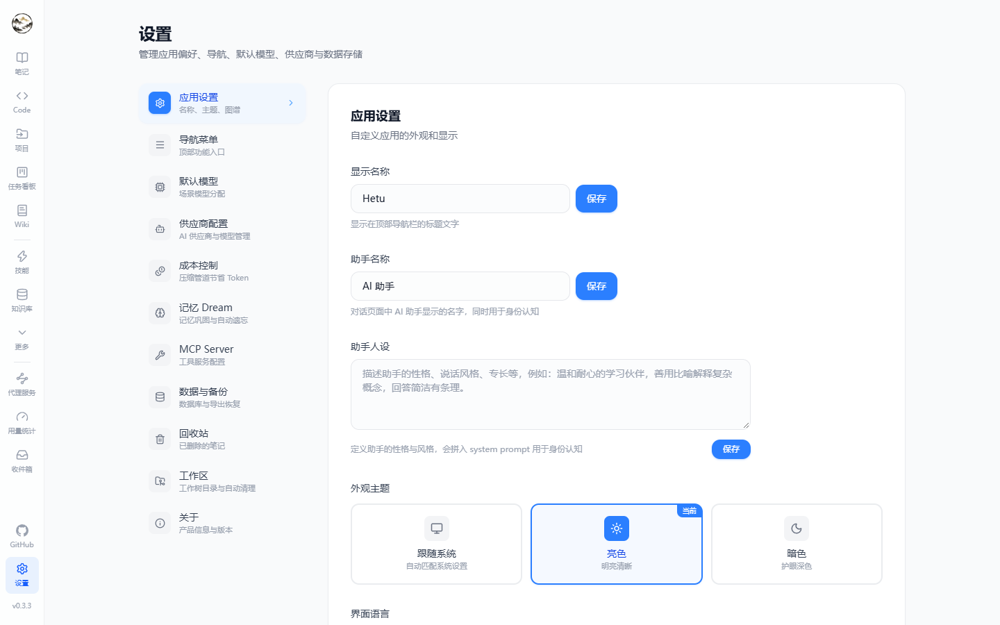

### 🖥️ 桌面应用（Tauri 2，可选）

- 原生窗口 + **系统托盘**（关闭默认最小化到托盘，可设置），后端作为 **sidecar** 自动拉起并等待 `/api/health`。
- **自动更新**：GitHub 主源 + 三个加速镜像回退，双渠道（`fat` 自带 .NET 运行时 / `slim` 需系统 .NET 10）。
- 数据目录由外壳通过 `HETU_DATA_DIR` 注入（SQLite 与日志都在用户数据目录）。

### 🔐 隐私与存储

- 100% 本地运行，无需账号；API Key 用 ASP.NET DataProtection 加密（Windows 走 DPAPI）。
- 向量：本地 `sqlite-vec`，或 PostgreSQL `pgvector`；两种数据库都能跑同一套功能。

---

## 🧱 技术栈

| 层 | 技术 |
| --- | --- |
| 后端 | ASP.NET Core 10 · EF Core 10 · Serilog · Scalar（OpenAPI 文档 `/scalar/v1`） |
| 存储 | SQLite（默认，`sqlite-vec`）/ PostgreSQL 16+（`pgvector`） |
| 前端 | React 19 · TypeScript 6 · Vite 8 · Tailwind CSS 4 · react-router 7 |
| 状态 | Zustand（客户端）+ TanStack Query（服务端） |
| 编辑器 | Milkdown（WYSIWYG）/ CodeMirror（代码与源码）/ xterm.js（终端）/ react-markdown + KaTeX + Mermaid + DOMPurify |
| 可视化 | ECharts · XYFlow + dagre（图谱与工作流） |
| AI | OpenAI 兼容 & Anthropic 协议 · Embedding · SSE 流式 · MCP（JSON-RPC 2.0） |
| 桌面 | Tauri 2（Rust 外壳 + sidecar 后端 + 自动更新） |
| 国际化 | i18next（简体中文 / English） |

## 📂 目录结构

```
Hetu/
├── src/
│   ├── Hetu.Api/                                 # Web API + 后台任务宿主
│   ├── Hetu.Core/                                # 领域实体、服务、仓储接口
│   ├── Hetu.Infrastructure/                      # EF Core、AI Provider、MCP、sqlite-vec
│   ├── Hetu.Infrastructure.PostgresMigrations/   # PostgreSQL 迁移
│   └── Hetu.Shared/                              # DTO 与共享模型
├── frontend/                                     # React + Vite 应用
├── shell/hetu-desktop/                           # Tauri 2 桌面外壳（Rust + 打包脚本）
├── scripts/                                      # 启动 / 打包 / 发版 / 冒烟测试脚本
├── docs/                                         # PRD、截图
└── AGENTS.md                                     # 实现约定
```

### 路由一览（`frontend/src/App.tsx`）

| 路由 | 页面 | 说明 |
| --- | --- | --- |
| `/` | 笔记 | 笔记本树 + 笔记列表 + 编辑器 |
| `/code` | Agent 工作台 | 对话与 Code 会话（`/chat`、`/work` 重定向到这里） |
| `/projects` | 项目 | 本地 / SSH 项目与分组 |
| `/kanban`、`/kanban/:taskId` | 任务看板 | 看板与任务详情（运行步骤、评论） |
| `/wiki` | Wiki | 生成套件与页面 |
| `/knowledge-base` | 知识库 | 概览 / 索引管理 / 搜索测试 |
| `/graph` | 知识图谱 | 实体与关系可视化 |
| `/memories` | 记忆 | 记忆库、记忆图与 Dream |
| `/tasks/background`、`/tasks/scheduled` | 后台任务 / 定时任务 | 任务监控与 Cron |
| `/workflows` | 工作流 | 可视化编排 Agent |
| `/agents`、`/skills`、`/tools` | 智能体 / 技能 / 工具 | 提示预设、技能与工具管理 |
| `/models` | 大模型 | 供应商与模型 |
| `/proxy` | 代理服务 | OpenAI / Anthropic 兼容入口 |
| `/usage` | 用量统计 | 用量与成本 |
| `/inbox` | 收件箱 | 通知中心 |
| `/apps` | 应用 | 内嵌网页应用 |
| `/tags`、`/trash` | 标签 / 回收站 | 标签管理、软删除笔记 |
| `/settings` | 设置 | 应用 / 导航 / 模型 / 供应商 / 成本 / 记忆 / MCP / 数据备份 / 工作区 / 关于 |
| `/share/:code` | 分享 | 公开只读笔记页 |

## 🚀 快速开始

### 环境要求

- .NET SDK **10.0+**
- Node.js **20+**
- （可选）PostgreSQL **16+** 并安装 `pgvector`

### 一键启动

```bash
# Linux / macOS / Git Bash
./scripts/start.sh

# PowerShell
.\scripts\start.ps1
```

### 手动启动

```bash
# 后端（默认 http://localhost:5000）
dotnet run --project src/Hetu.Api --urls "http://localhost:5000"

# 前端（默认 http://localhost:5174）
cd frontend
npm install
npm run dev
```

打开 <http://localhost:5174>，API 在 <http://localhost:5000/api>，接口文档 <http://localhost:5000/scalar/v1>。

### 桌面应用（Tauri 2）

```bash
# 开发（并行起 dotnet + vite + tauri）
pwsh ./scripts/desktop-dev.ps1

# 打包（先出 sidecar，再出安装包）
pwsh ./scripts/publish-backend.ps1 -Mode SelfContained -Rid win-x64      # fat：自带运行时
pwsh ./scripts/publish-backend.ps1 -Mode FrameworkDependent -Rid win-x64 # slim：需 .NET 10
cd shell/hetu-desktop
npm run tauri:build -- --config src-tauri/tauri.slim.conf.json
```

## ⚙️ 配置模型

1. 打开应用 → **大模型**（或 设置 → 供应商配置）：新增供应商（OpenAI 兼容 / Anthropic），填 Base URL 与 API Key。
2. 在供应商下新增模型，指定用途 `chat` / `embedding` / `completion`。
3. 设置 → **默认模型** 按场景指定默认（对话 / 编码 / Wiki / 图谱 / 整理 / 笔记 AI）。

> API Key 加密存储；模型调用只从本机发出。

## 🗄️ 切换到 PostgreSQL

```bash
export DatabaseProvider=Postgresql
export ConnectionStrings__DefaultConnection="Host=localhost;Database=hetu;Username=postgres;******"

# 应用迁移（表结构变化时才需要）
dotnet ef database update \
  --project src/Hetu.Infrastructure.PostgresMigrations \
  --startup-project src/Hetu.Api
```

向量维度由 `Embedding:Dimensions` 控制（默认 `1536`），必须与所选 Embedding 模型一致。

## 🧪 构建与验证

```bash
# 后端（整个解决方案，要求 0 告警）
dotnet build Hetu.slnx

# 前端：类型检查 + 生产构建 / 静态检查
cd frontend
npm run build
npm run lint

# API 冒烟测试（需先启动后端）
./scripts/test-api.sh
```

本项目对**告警零容忍**：不允许 `#pragma warning disable`、`eslint-disable`、`SuppressMessage` 之类的抑制，只能修根因。详见 [`AGENTS.md`](./AGENTS.md)。

## 📦 发版

```bash
# 1) 同步两处版本号：shell/hetu-desktop/src-tauri/tauri.conf.json 与 src/Hetu.Api/Hetu.Api.csproj
# 2) 合并到 main 后打 tag 并推送，触发 Release Build
pwsh ./scripts/tag-release.ps1 -Version 0.3.3
```

CI 会构建 `fat` / `slim` 两个渠道的 Windows（NSIS/MSI）与 Linux（AppImage/deb）安装包，生成自动更新清单
（`latest.json` / `latest-slim.json` + 三个镜像变体）并创建 GitHub Release；缺少任一渠道清单时发布会直接失败。

## ⚠️ 已知限制

- 尚未引入自动化测试工程（当前验证方式：构建 + `eslint`/`tsc` + API 冒烟 + 浏览器实测）。
- MCP 仅 `stdio` 完整可用，`sse` 可配置但未接线。
- 笔记全文检索基于 `LIKE`，FTS5 / `tsvector` 还在计划中。
- Anthropic 未提供公开 Embedding 接口，`embedding` 用途请选 OpenAI 兼容供应商。

## 🤝 参与贡献

欢迎提 Issue 与 PR。动手前请先看 [`AGENTS.md`](./AGENTS.md)（分层、命名、提交格式、验证方式与告警约定）。

```
<type>(<scope>): <subject>

# type:  feat | fix | docs | style | refactor | perf | test | chore
# scope: api | ui | db | ai | work | desktop | config
```

## 📜 许可证

[Apache License 2.0](./LICENSE)
